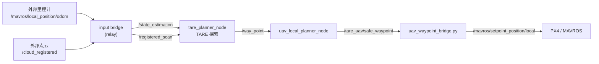

# tare_planner 重构方案（评审稿）

> 状态：**仅方案，未执行任何代码改动**。每个决策点都给了【推荐】选项和理由。
> 生成时间：2026-09-16
> 适用入口：`roslaunch tare_planner tare_uav_fixed_height.launch ...`

---

## 0. 先明确三条底线

1. **行为不变优先**：重构只做「搬家 / 拆文件 / 去重 / 改名」，不改算法、不改默认值、不改话题名。
2. **每阶段独立可回滚**：一个阶段一个 commit，编译通过 + 你能验收后才进入下一阶段。
3. **不动上游语义**：上游 TARE 的探索逻辑（`grid_world` / `viewpoint_manager` / `keypose_graph` / `local_coverage_planner`）算法一行不改。

---

## 1. 现状体检（实测数据）

| 指标 | 数值 |
|---|---|
| `launch/tare_uav_fixed_height.launch` | 357 行 / **128 个 `<arg>`** / **122 个 `<param>`** / 20 个 `<group>` |
| `launch/tare_uav_integrated_mission.launch` | 220 行 / **118 个 `<arg>`**，与上面重叠约 90% |
| 超千行 C++ 文件 | `sensor_coverage_planner_ground.cpp` **2014**、`viewpoint_manager.cpp` 1504、`grid_world.cpp` 1202、`utils/misc_utils.cpp` 1092、`keypose_graph.cpp` 1036 |
| 上游文件被侵入 | `sensor_coverage_planner_ground.cpp` **+668 行**、同名 `.h` **+81 行**、`viewpoint_manager.cpp` +18 行 |
| 参数真源 | `config/uav_fixed_height.yaml` 约 **130** 个键 ＋ launch 的 **122** 个 `<param>`，两份清单重叠且部分取值不同 |
| Python | **14** 个脚本平铺在 `scripts/`，合计约 4600 行 |
| `config/` | 10 个 yaml，含 `real_robot (copy).yaml`、`real_robot.yaml.bak` 两个垃圾文件 |
| `CMakeLists.txt` | 13 组手写 `add_library` + `add_dependencies` + `target_link_libraries` 样板；硬编码 `/opt/nea/topaz/include`（**本机 `ls /opt/nea/topaz` 报 No such file**） |

---

## 2. 问题清单（按严重度）

### ① 自研逻辑写进了上游类 —— 最严重

`include/sensor_coverage_planner/sensor_coverage_planner_ground.h` 的 `PlannerParameters` 结构体被追加了：

- 9 个 `sub_*_topic_` / `pub_*_topic_` 字符串
- 4 个 bool：`kUseFixedFlightHeight`、`kFixedFlightHeightRelativeToStart`、`kEnableManualGoalNavigation`、`kEnableFixedStartPlanning`
- 8 个 double：`kFixedFlightHeight`、`kExplorationWarmupSeconds`、`kExplorationCompletionConfirmSeconds`、`kManualGoal*`
- 新增 `enum class MissionMode { EXPLORATION, HOLD, NAVIGATION }`
- `PlannerData` 新增 `initial_position_set_`

配合 `.cpp` 里的 **+668 行**，`SensorCoveragePlanner3D` 这一个类现在同时承担 5 件事：

```
探索规划 + 任务状态机 + 手动目标导航 + 固定起点规划 + 路径/状态发布
```

**后果**：上游 `git pull` 必然冲突；改任何一个自研功能都可能波及探索主流程；无法单独测试任务状态机。

### ② launch 是「参数转抄机」

128 个 `<arg>` 里有 122 个被逐条 `<param>` 原样重写。以 `max_xy_speed` 为例，同一个值要写三处：

```xml
<!-- 1) arg 声明 -->
<arg name="max_xy_speed" default="0.35"/>
<!-- 2) 节点 param -->
<param name="max_xy_speed" type="double" value="$(arg max_xy_speed)"/>
<!-- 3) 有的还写在 yaml 里 -->
```

launch 内还留着注释 `<!-- Keep the launch arguments authoritative ... -->`，说明「到底哪个生效」这个问题已经踩过坑。

### ③ 配置有三个真源，且互相覆盖

```
config/uav_fixed_height.yaml   ──┐
                                 ├──► 节点 <rosparam load> ──► <param> 覆盖 ──► 生效值
launch 的 122 个 <param>       ──┘        （后者胜出，但没人一眼看得出）
节点内硬编码默认值              ──┘
```

已知不一致举例：yaml 写 `kFixedFlightHeight : 1.5`，launch 默认 `fixed_flight_height=1.5`，而你的命令传 `1.0`；yaml 写 `kSensorRange : 5.0`，你的命令传 `8.0`。

### ④ 两个近乎重复的巨型 launch

`fixed_height`（128 arg）与 `integrated_mission`（118 arg）重叠约 90%，任何接线改动都要改两遍。

### ⑤ 工具库越界

`include/utils/misc_utils.h`（376 行）里混入 13 处 ROS 参数读取。纯工具函数库不该依赖 ROS 参数系统，导致单元测试无法脱离 roscore。

### ⑥ 构建样板与死路径

- 13 个目标每个都重复三行样板，新增一个库要抄三行
- `/opt/nea/topaz/include` 是别的机器残留，本机不存在
- `BUILD_STATIC_LIBS` / `BUILD_SHARED_LIBS` 设了但 catkin 不使用

### ⑦ 垃圾文件与疑似无关代码

| 文件 | 说明 |
|---|---|
| `config/real_robot (copy).yaml` | 带空格和「copy」的临时文件，未跟踪 |
| `config/real_robot.yaml.bak` | 备份文件，未跟踪 |
| `scripts/airsim_*.py`（593 行）、`scripts/blocks_*.py`（1450 行） | 疑似属于 AirSim/Docker 那套工作流，与你现在的 PX4 + Gazebo + FAST-LIO + MAVROS 用法无关 —— **需你确认** |

---

## 3. 目标架构

### 3.1 目录结构

```
src/tare_planner/
├── config/
│   ├── tare/                       # 上游地面场景 yaml，原样保留（campus/forest/garage/indoor/matterport/tunnel）
│   └── uav/
│       ├── topics.yaml             # 话题接线 —— 唯一真源
│       ├── frames.yaml             # 坐标系 / 静态 TF
│       ├── vehicle.yaml            # 尺寸、质量、clearance
│       ├── limits.yaml             # 速度/加速度/jerk/偏航/对准
│       ├── local_planner.yaml      # UAV 局部规划器
│       ├── mission.yaml            # 探索 / 手动导航 / 固定起点 / 起飞稳定
│       ├── safety.yaml             # 边界 / 围栏 / offboard / RC 接管
│       └── profiles/
│           ├── sim.yaml            # 仿真差异覆盖
│           └── real.yaml           # 实机差异覆盖
├── launch/
│   ├── tare_uav_fixed_height.launch        # ≈25 行：只 include + 少量开关
│   ├── tare_uav_integrated_mission.launch  # ≈25 行
│   └── include/
│       ├── _input_bridge.launch
│       ├── _tf_bridge.launch
│       ├── _local_planner.launch
│       ├── _pose_bridge.launch
│       ├── _offboard.launch
│       ├── _navigation_boundary.launch
│       ├── _rviz.launch
│       └── _bag.launch
├── include/mission/                # ★ 新增：从上游 node 抽出的自研逻辑
│   ├── mission_types.h             # MissionMode / GoalRequest / MissionStatus
│   ├── manual_goal_navigator.h     # 手动目标导航（RViz 2D Nav Goal）
│   ├── fixed_start_planner.h       # 固定起点规划
│   └── mission_config.h            # ★ 自研参数结构体（与上游 PlannerParameters 分离）
├── src/mission/…                   # 对应实现
├── include/uav_local_planner/      # 保留（core 与 node 已分离得不错）
├── src/uav_local_planner/…         # 仅做内部拆分
└── scripts/
    ├── tare_uav/                   # ★ 14 个脚本收敛成 1 个 python 包
    │   ├── __init__.py
    │   ├── mavros.py               # 状态机判定、模式/解锁服务封装
    │   ├── params.py               # 统一参数读取 + 校验
    │   ├── geometry.py             # 路径/偏航/平滑公共算法
    │   ├── bridges/                # waypoint_bridge、lidar_bridge …
    │   └── tools/                  # path_exporter、viewer、validator …
    └── uav_*.py                    # 只留 3~5 个瘦 CLI 入口
```

### 3.2 数据流（保持不变）



> 重构前后这张图**完全一致**，变的只是「这些节点由哪个 launch 文件、读哪些 yaml 启动」。

### 3.3 分层职责（重构后）

| 层 | 内容 | 是否触碰 |
|---|---|---|
| L1 上游算法 | `grid_world` / `viewpoint_manager` / `keypose_graph` / `local_coverage_planner` / `tsp_solver` … | ❌ 不改 |
| L2 上游节点壳 | `sensor_coverage_planner_ground.{h,cpp}` | ⚠️ 只做「减法」：把自研 668 行移出 |
| L3 自研任务层 | `mission/*`（新增） | ✅ 主要战场 |
| L4 自研 UAV 控制层 | `uav_local_planner` / `uav_saved_map_planner` | ✅ 内部拆分 |
| L5 胶水与工具 | `scripts/tare_uav/*` | ✅ 收敛去重 |
| L6 启动与配置 | `launch/` `config/` | ✅ 主力战场 |

---

## 4. 分阶段执行计划

### P0 — 安全网（无代码改动）

| 项 | 内容 |
|---|---|
| 目标 | 让后续每一步都能回退、都能对比 |
| 动作 | 1. 建分支 `refactor/uav-layer`<br/>2. 把 untracked 自研文件（`scripts/`、`test/`、`uav_*`、launch、config）纳入版本控制，提交一次 baseline<br/>3. 固化基线：用你那条命令启动一次，记录 `rosnode list` / `rostopic list` / 一次完整任务日志 |
| 验收 | `git log` 有 baseline commit；基线日志已存档 |
| 回滚 | `git checkout main` |

### P1 — 无风险清理（零行为变化）

| 项 | 内容 |
|---|---|
| 删除 | `config/real_robot (copy).yaml`、`config/real_robot.yaml.bak`、`CMakeLists.txt` 里的 `/opt/nea/topaz/include` |
| CMake | 用 `foreach` + 宏消除 13×3 样板；`catkin_install_python` 列表改为脚本目录通配 |
| 附带 | `include/utils/misc_utils.h` 里 13 处参数读取下沉为显式入参（**这一步放到 P3，因为它会动签名**） |
| 验收 | `catkin_make` 通过；节点启动行为不变 |
| 风险 | 极低 |

### P2 — launch 解耦 ⭐ 收益最大、风险最低

| 项 | 内容 |
|---|---|
| 动作 1 | 建 `config/uav/*.yaml`（见 §6 映射表），把 122 个 `<param>` 全部搬入 |
| 动作 2 | 拆出 `launch/include/_*.launch`，每个文件只管一件事 |
| 动作 3 | 主 launch 收缩为：`profile` + 5 个以内开关 + `<rosparam load>` + 8 个 `<include>` |
| 动作 4 | **兼容层**：保留 `tare_uav_fixed_height_legacy.launch`，把老的 128 个 arg 接收后转发给新结构 —— 你现在这条命令可以原样继续用 |
| 验收 | 你的原命令能正常启动；`rosnode list` 与基线一致；话题列表 diff 为空 |
| 风险 | 低（纯配置搬迁） |

### P3 — C++ 分层

| 项 | 内容 |
|---|---|
| 动作 1 | 把 `.cpp` 里 +668 行按功能切到 `src/mission/`：`manual_goal_navigator` / `fixed_start_planner` / `mission_state_machine` |
| 动作 2 | 上游 `SensorCoveragePlanner3D` 只保留：`std::unique_ptr<MissionController> mission_;` + 必要的钩子调用（目标是把上游 diff 从 +668 行压到 +30 行以内） |
| 动作 3 | `PlannerParameters` 里的自研字段迁到 `MissionConfig`，`kUseFixedFlightHeight` 等只在上游保留最少必要项 |
| 动作 4 | `uav_local_planner_node.cpp`（634 行）拆为 `param_loader.cpp` / `ros_io.cpp` / `main.cpp`，算法继续留在已存在的 `uav_local_planner_core` |
| 动作 5 | `misc_utils.h` 去 ROS 参数依赖，改为显式入参 |
| 验收 | `catkin_make` 通过；用基线同一场景跑一次，对比 `/way_point` 轨迹（应完全一致） |
| 风险 | 中 —— 需要行为对比 |

### P4 — Python 脚本收敛

| 项 | 内容 |
|---|---|
| 动作 1 | 建 `scripts/tare_uav/` 包，抽出 `mavros.py`（状态判定/解锁/模式切换）、`params.py`、`geometry.py`（路径平滑/偏航） |
| 动作 2 | `uav_waypoint_bridge.py`（684 行）与 `uav_offboard_manager.py`（230）共用上述模块 |
| 动作 3 | `uav_exploration_viewer.py`（690）拆成「数据源 / 渲染」两部分 |
| 动作 4 | 未使用脚本移入 `scripts/_legacy/`（**不直接删**，见决策 D6） |
| 验收 | 每个入口脚本 `--help` 可用；bridge 实跑一次话题一致 |
| 风险 | 低-中 |

### P5 — 上游同步友好化

| 项 | 内容 |
|---|---|
| 动作 1 | 复查上游文件 diff，把能通过「组合 / 扩展」实现的部分从上游类里彻底移出 |
| 动作 2 | 写 `UPSTREAM_SYNC_CN.md`：记录「哪些上游文件被改、为什么、下次 pull 怎么处理」 |
| 验收 | `git diff --stat` 中上游文件只剩必要改动 |
| 风险 | 中 |

---

## 5. 需要你确认的决策点

| # | 决策 | 【推荐】 | 理由 |
|---|---|---|---|
| **D1** | 重构范围 | **自研层 + 上游被侵入部分** | 只整理 launch/scripts 解决不了 ①（最严重的问题）；但又不必去拆上游 5 个超千行文件 |
| **D2** | 上游同步 | **需要保持可合并** | 上游 TARE 仍在更新（本仓库最后一次上游提交是 `use ortools v9.8`），放弃同步等于放弃 bugfix |
| **D3** | 调参入口 | **参数全部下沉 YAML** | 唯一能根除 ②③ 的办法；配合 D4 的兼容层，你的使用习惯不用改 |
| **D4** | 老命令兼容 | **保留 `_legacy.launch` 转发层** | 你的 30 行命令行可以原样继续用，将来想切再切 |
| **D5** | 推进方式 | **分阶段小步** | P3 风险最高，独立阶段便于定位问题 |
| **D6** | 14 个脚本 | **移入 `_legacy/` 而非直接删** | `airsim_*` / `blocks_*` 疑似废弃，但删是不可逆的；先挪走观察一个迭代周期 |
| **D7** | 验收基线 | **你的 roslaunch 命令能正常启动 + 一次完整任务** | `test/` 里只有 3 个 test，覆盖不足以作为主要依据 |
| **D8** | 是否允许改命令行 | **允许（有新老两套）** | 新 launch 只留 ≤6 个开关；老接口由 D4 兼容层兜住 |

---

## 6. 参数搬迁映射表（122 个 `<param>` → YAML）

### 6.1 按目标文件分组

| 目标文件 | 覆盖的参数组 | 约计个数 |
|---|---|---|
| `config/uav/topics.yaml` | TARE 节点 17 个 `sub_/pub_*_topic_`；输入桥 4 个；waypoint bridge 4 个；RViz 相关 4 个 | **≈29** |
| `config/uav/frames.yaml` | `map_frame` `camera_init_frame` `body_frame` `sensor_frame` `vehicle_frame` `base_frame` `map_to_camera_init_yaw` `sensor_to_vehicle_yaw` | **8** |
| `config/uav/vehicle.yaml` | `vehicle_length/width/height/mass/length_assumed` + `uav_horizontal_clearance` `uav_vertical_clearance` | **7** |
| `config/uav/limits.yaml` | `max_xy_speed` `max_z_speed` `max_xy_accel` `max_z_accel` `max_xy_jerk` `max_z_jerk` `max_yaw_rate` `heading_alignment_enabled` `heading_alignment_tolerance` `motion_yaw_min_distance` `setpoint_rate` `yaw_from_motion` `default_yaw` `smooth_setpoints` `bridge_override_z` | **15** |
| `config/uav/local_planner.yaml` | `local_*` 共 21 项（rate / lookahead / obstacle_range / voxel / candidate_* / collision_point_threshold / reaction_time / max_deceleration / 各类 timeout / require_* / allow_identity_*） | **21** |
| `config/uav/mission.yaml` | `fixed_flight_height` `fixed_flight_height_relative_to_start` `tare_sensor_range` `tare_min_add_point_num_*` `tare_min_add_frontier_point_num` `exploration_completion_confirm_seconds` `enable_manual_goal_navigation` `enable_fixed_start_planning` `manual_goal_*`(5) `takeoff_*`(3) `start_exploration_*`(2) | **21** |
| `config/uav/safety.yaml` | `run_navigation_boundary` `navigation_boundary_file` `safety_geofence` `safety_geofence_file` `run_offboard_manager` `auto_arm` `offboard_*`(5) `reassert_offboard_after_mode_exit` `hold_setpoint_until_armed` `require_landed_state_for_auto_arm` `rc_override_*`(7) | **21** |
| `config/uav/profiles/{sim,real}.yaml` | 仅放与上表不同之处（`mavros_namespace`、`uav_pose_topic`、`offboard_mode`、`run_offboard_manager` …） | 少量 |
| 保留为 launch arg（≤6） | `profile`(sim/real) `rviz` `rviz_config` `rosbag_record` `bag_path` `bag_name_prefix` | **6** |

### 6.2 搬迁原则

1. **话题与坐标系**优先搬（它们是「接线」，与调参无关）。
2. **限幅与 clearance** 搬完后，`config/uav/limits.yaml` 就是速度参数的唯一入口。
3. 节点内默认值**保持不变**，只是从「代码里」变成「yaml 里」，保证不搬迁也能跑。
4. 搬迁后 `<rosparam command="load">` 与 `<param>` 不再重叠 —— 一处定义，一处生效。

---

## 7. 风险与保障

| 风险 | 缓解措施 |
|---|---|
| 参数搬迁后取值变化 | 搬迁前用 `rosparam dump` 导出当前**实际生效**的全量参数，搬迁后 dump 再对比，要求 diff 为空 |
| launch 拆分后节点启动顺序变化 | `<include>` 按原顺序排列；`required="true"` 保持 |
| C++ 抽离引入行为差异 | P3 前后各跑一次同场景，对比 `/way_point` 与 `/trajectory` 的轨迹（可用 `uav_path_exporter.py`） |
| 上游 `git pull` 冲突 | P5 后上游 diff 收敛；同步前先跑基线 |
| 重构中途被打断 | 每阶段独立 commit + 分支；任何阶段都可单独 revert |

### 全局验收门

每个阶段结束必须同时满足：

- [ ] `catkin_make` 通过，无新增 warning
- [ ] 你的原 roslaunch 命令能启动（P2 之后经兼容层）
- [ ] `rosnode list` / `rostopic list` 与 P0 基线一致
- [ ] 一次完整任务可跑（起飞 → 探索 → 到点）
- [ ] `rosparam dump` 与基线 diff 为空

---

## 8. 明确**不做**的事

- ❌ 不改 TARE 探索算法（`grid_world` / `viewpoint_manager` / `keypose_graph` / `local_coverage_planner` / `tsp_solver`）
- ❌ 不改 UAV 局部规划的候选角度/碰撞判定逻辑
- ❌ 不改任何话题名、坐标系名、服务名
- ❌ 不改 `uav_local_planner_core` 的算法（它已经和 ROS 解耦得不错，只动 node 层）
- ❌ 不升级 or-tools / PCL / ROS 版本
- ❌ 不引入新的第三方依赖

---

## 9. 工作量粗估

| 阶段 | 相对工作量 | 预计产物 |
|---|---|---|
| P0 | 5% | 分支 + baseline commit + 基线日志 |
| P1 | 10% | 清理 commit + CMake 瘦身 |
| P2 | 30% | 8 个 include launch + 8 个 yaml + 兼容层 |
| P3 | 35% | `mission/` 新模块 + 上游 diff 收敛 |
| P4 | 15% | `scripts/tare_uav/` 包 |
| P5 | 5% | `UPSTREAM_SYNC_CN.md` |

> 建议顺序执行：P2 完成后收益已经很大（launch 从 357 行降到 ~25 行，参数单一真源），
> 如果时间紧张，**P0 → P1 → P2 是一个可独立交付的最小闭环**。

---

## 附：待确认后我会做的第一件事

按推荐选项（D1~D8 全选【推荐】）执行 **P0**：

1. `git checkout -b refactor/uav-layer`
2. 把 `scripts/`、`test/`、`launch/tare_uav_*.launch`、`config/uav_fixed_height.yaml`、`src/uav_*`、`include/uav_*` 加入版本控制并提交
3. `rosparam dump` 导出当前生效参数存档到 `docs/baseline/`
4. 记录 `rosnode list` / `rostopic list` 基线

P0 不改任何代码，完成后我会停下来等你确认再进 P1。
